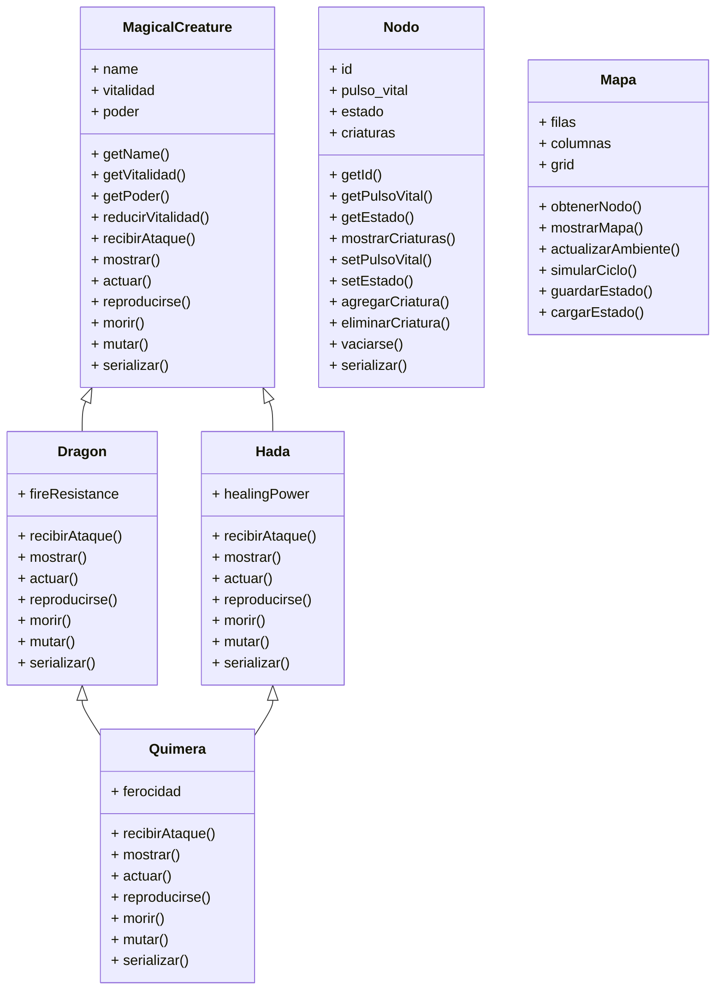

```mermaid
classDiagram

class MagicalCreature {
    + name
    + vitalidad
    + poder
    + getName()
    + getVitalidad()
    + getPoder()
    + reducirVitalidad()
    + recibirAtaque()
    + mostrar()
    + actuar()
    + reproducirse()
    + morir()
    + mutar()
    + serializar()
}

class Dragon {
    + fireResistance
    + recibirAtaque()
    + mostrar()
    + actuar()
    + reproducirse()
    + morir()
    + mutar()
    + serializar()
}

class Hada {
    + healingPower
    + recibirAtaque()
    + mostrar()
    + actuar()
    + reproducirse()
    + morir()
    + mutar()
    + serializar()
}

class Quimera {
    + ferocidad
    + recibirAtaque()
    + mostrar()
    + actuar()
    + reproducirse()
    + morir()
    + mutar()
    + serializar()
}

class Nodo {
    + id
    + pulso_vital
    + estado
    + criaturas
    + getId()
    + getPulsoVital()
    + getEstado()
    + mostrarCriaturas()
    + setPulsoVital()
    + setEstado()
    + agregarCriatura()
    + eliminarCriatura()
    + vaciarse()
    + serializar()
}

class Mapa {
    + filas
    + columnas
    + grid
    + obtenerNodo()
    + mostrarMapa()
    + actualizarAmbiente()
    + simularCiclo()
    + guardarEstado()
    + cargarEstado()
}

MagicalCreature <|-- Dragon
MagicalCreature <|-- Hada
Dragon <|-- Quimera
Hada <|-- Quimera
```
