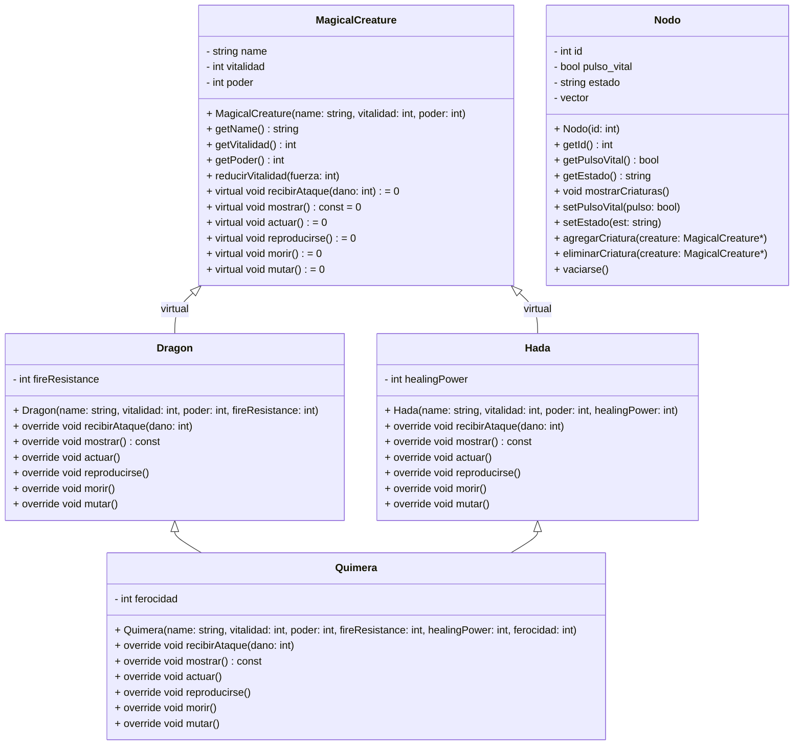

```mermaid
classDiagram
    class MagicalCreature {
        - string name
        - int vitalidad
        - int poder
        + MagicalCreature(name: string, vitalidad: int, poder: int)
        + getName() string
        + getVitalidad() int
        + getPoder() int
        + reducirVitalidad(fuerza: int)
        + virtual void recibirAtaque(dano: int) = 0
        + virtual void mostrar() const = 0
        + virtual void actuar() = 0
        + virtual void reproducirse() = 0
        + virtual void morir() = 0
        + virtual void mutar() = 0
    }

    class Dragon {
        - int fireResistance
        + Dragon(name: string, vitalidad: int, poder: int, fireResistance: int)
        + override void recibirAtaque(dano: int)
        + override void mostrar() const
        + override void actuar()
        + override void reproducirse()
        + override void morir()
        + override void mutar()
    }

    class Hada {
        - int healingPower
        + Hada(name: string, vitalidad: int, poder: int, healingPower: int)
        + override void recibirAtaque(dano: int)
        + override void mostrar() const
        + override void actuar()
        + override void reproducirse()
        + override void morir()
        + override void mutar()
    }

    class Nodo {
        - int id
        - bool pulso_vital
        - string estado
        - vector<MagicalCreature*>
        + Nodo(id: int)
        + getId() int
        + getPulsoVital() bool
        + getEstado() string
        + void mostrarCriaturas()
        + setPulsoVital(pulso: bool)
        + setEstado(est: string)
        + agregarCriatura(creature: MagicalCreature*)
        + eliminarCriatura(creature: MagicalCreature*)
        + vaciarse()
    }

    class Quimera {
        - int ferocidad
        + Quimera(name: string, vitalidad: int, poder: int, fireResistance: int, healingPower: int, ferocidad: int)
        + override void recibirAtaque(dano: int)
        + override void mostrar() const
        + override void actuar()
        + override void reproducirse()
        + override void morir()
        + override void mutar()
    }

    MagicalCreature <|-- Dragon : virtual
    MagicalCreature <|-- Hada : virtual
    Dragon <|-- Quimera
    Hada <|-- Quimera
```
