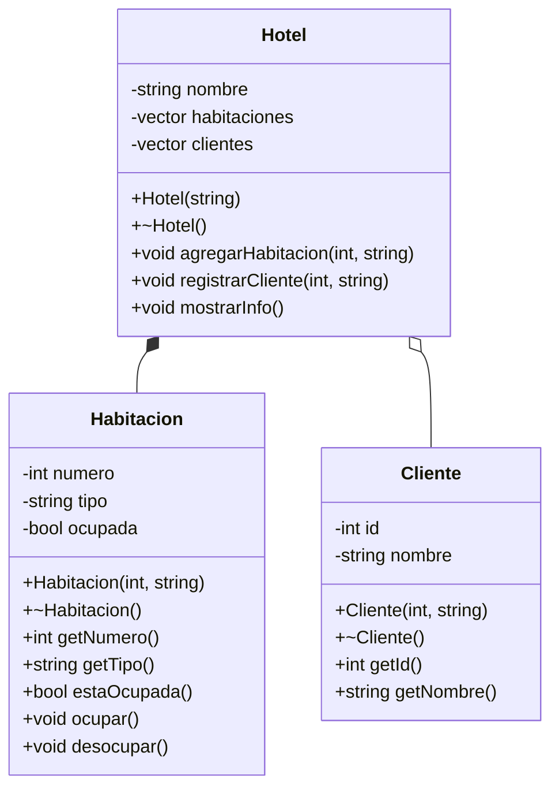

```mermaid
classDiagram

    class Habitacion {
        -int numero
        -string tipo
        -bool ocupada
        +Habitacion(int, string)
        +~Habitacion()
        +int getNumero()
        +string getTipo()
        +bool estaOcupada()
        +void ocupar()
        +void desocupar()
    }

    class Cliente {
        -int id
        -string nombre
        +Cliente(int, string)
        +~Cliente()
        +int getId()
        +string getNombre()
    }

    class Hotel {
        -string nombre
        -vector<Habitacion> habitaciones
        -vector<Cliente*> clientes
        +Hotel(string)
        +~Hotel()
        +void agregarHabitacion(int, string)
        +void registrarCliente(int, string)
        +void mostrarInfo()
    }

    Hotel *-- Habitacion
    Hotel o-- Cliente
```
