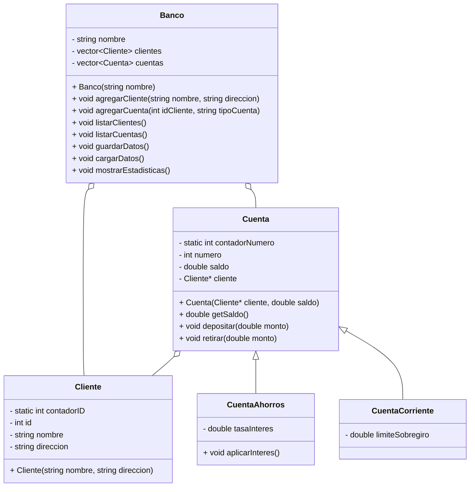

```mermaid
classDiagram
    class Banco {
        - string nombre
        - vector~Cliente~ clientes
        - vector~Cuenta~ cuentas
        + Banco(string nombre)
        + void agregarCliente(string nombre, string direccion)
        + void agregarCuenta(int idCliente, string tipoCuenta)
        + void listarClientes()
        + void listarCuentas()
        + void guardarDatos()
        + void cargarDatos()
        + void mostrarEstadisticas()
    }

    class Cliente {
        - static int contadorID
        - int id
        - string nombre
        - string direccion
        + Cliente(string nombre, string direccion)
    }

    class Cuenta {
        - static int contadorNumero
        - int numero
        - double saldo
        - Cliente* cliente
        + Cuenta(Cliente* cliente, double saldo)
        + double getSaldo()
        + void depositar(double monto)
        + void retirar(double monto)
    }

    class CuentaAhorros {
        - double tasaInteres
        + void aplicarInteres()
    }

    class CuentaCorriente {
        - double limiteSobregiro
    }

    Cuenta <|-- CuentaAhorros
    Cuenta <|-- CuentaCorriente
    Banco o-- Cliente
    Banco o-- Cuenta
    Cuenta o-- Cliente
```
