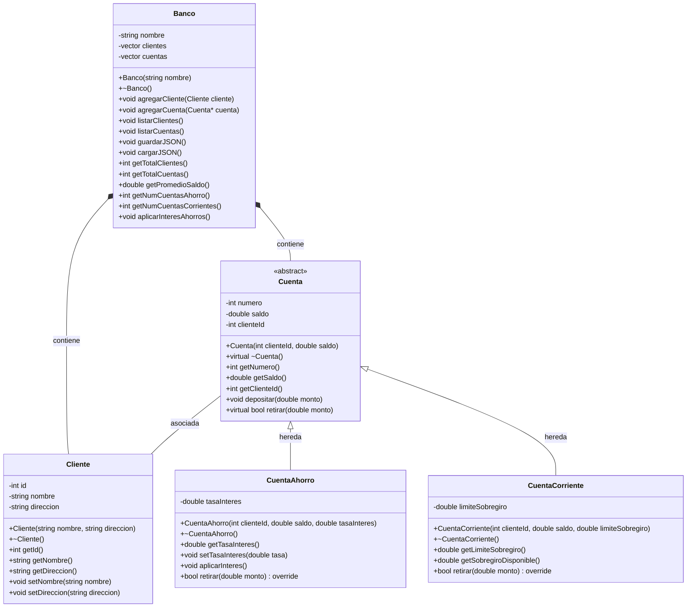

```mermaid
classDiagram
    class Banco {
        -string nombre
        -vector<Cliente> clientes
        -vector<Cuenta*> cuentas
        +Banco(string nombre)
        +~Banco()
        +void agregarCliente(Cliente cliente)
        +void agregarCuenta(Cuenta* cuenta)
        +void listarClientes()
        +void listarCuentas()
        +void guardarJSON()
        +void cargarJSON()
        +int getTotalClientes()
        +int getTotalCuentas()
        +double getPromedioSaldo()
        +int getNumCuentasAhorro()
        +int getNumCuentasCorrientes()
        +void aplicarInteresAhorros()
    }
    
    class Cliente {
        -int id
        -string nombre
        -string direccion
        +Cliente(string nombre, string direccion)
        +~Cliente()
        +int getId()
        +string getNombre()
        +string getDireccion()
        +void setNombre(string nombre)
        +void setDireccion(string direccion)
    }
    
    class Cuenta {
        <<abstract>>
        -int numero
        -double saldo
        -int clienteId
        +Cuenta(int clienteId, double saldo)
        +virtual ~Cuenta()
        +int getNumero()
        +double getSaldo()
        +int getClienteId()
        +void depositar(double monto)
        +virtual bool retirar(double monto)
    }
    
    class CuentaAhorro {
        -double tasaInteres
        +CuentaAhorro(int clienteId, double saldo, double tasaInteres)
        +~CuentaAhorro()
        +double getTasaInteres()
        +void setTasaInteres(double tasa)
        +void aplicarInteres()
        +bool retirar(double monto) override
    }
    
    class CuentaCorriente {
        -double limiteSobregiro
        +CuentaCorriente(int clienteId, double saldo, double limiteSobregiro)
        +~CuentaCorriente()
        +double getLimiteSobregiro()
        +double getSobregiroDisponible()
        +bool retirar(double monto) override
    }
    
    Banco *-- Cliente : contiene
    Banco *-- Cuenta : contiene
    Cuenta <|-- CuentaAhorro : hereda
    Cuenta <|-- CuentaCorriente : hereda
    Cuenta -- Cliente : asociada
```
